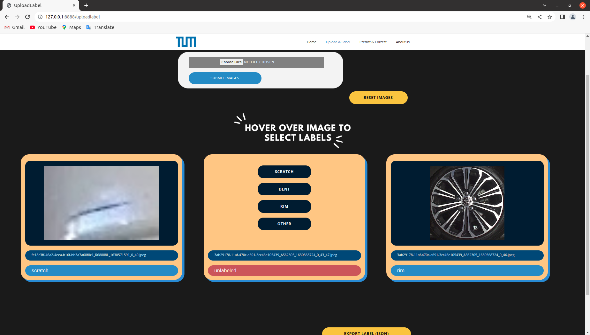

# Website Guide

##  Webpage description：

### Main functionalities:

#### Upload & Label page

On the "Upload & Label" page, you can upload one/more images with jpg, jpeg, png, or webp extensions. You can upload images more than once, and you will not lose previously uploaded images. If you want to delete all the images from the page, click on the "reset images" button.

After you uploaded your images, you can hover over each image to label the damage. Once you are finished with labelling, click on the "export label (JSON)" button on the bottom right corner.

#### Prediction & Correction

On this page, after uploading the images, you will automatically get out model's predictions for the damage class. In the case of incorrect prediction, you can correct the labels by hovering over the image and choosing the correct label. Click on "finish correcting, end session" once you're done verifying predictions, and your corrections will be used to re-train our model.

## How to run our website:

### How to run our website with docker:

1. Connect to LRZ network
    1. If you are already in campus network (eduroam), you are already connected to LRZ Network
    2. If you are outside campus network, connect to LRZ network via a VPN. Download [eduVPN](https://www.eduvpn.org/) and choose to connect to Technical University of Munich.

2. verify with the command ```docker --version``` in terminal to make sure docker is successfully installed locally. If it is already installed, you will get the version information of installed Docker. The output of the terminal would resemble:
    ```console
    Docker version 20.10.12, build 20.10.12-0ubuntu2~20.04.1.
    ```
    If you did not get a similar output, then docker is not installed/configured properly on your device.

3. Open local Terminal and run the command: 
    ```sh
    docker login gitlab.ldv.ei.tum.de:5005
    ```

4. Run the command: 
    ```sh
    docker run -p 8888:8888 gitlab.ldv.ei.tum.de:5005/ami2022/group07
    ```

5. Open your browser and enter the following address to open our web app: [http://127.0.0.1:8888/](http://127.0.0.1:8888/)

Notes:

- Ensure docker is installed and VPN is connected
- The docker container is also deployed to Kubernetes on NodePort 30700.


### How to run our website locally:
1. Clone the master branch from our [repository in Gitlab LDV](https://gitlab.ldv.ei.tum.de/ami2022/Group07).

2. Navigate to the cloned repository.

3. Install the required packages.
    ```
    pip -r requirements.txt
    ```

4. Run the app.py file (Group07/AMI_Web/app.py)

5. Open your browser and enter the following address to open our web app: [http://127.0.0.1:8888/](http://127.0.0.1:8888/)

Notes:

- Ensure that you use python 3.7 to avoid any incompatible libraries.
- Ensure that you have pip installed


### How to run our website on kubernetes:

1. Install kubectl on your local machine from [kubectl download page](https://kubernetes.io/docs/tasks/tools/)

2. Create a folder named .kube in your home directory
    ```
    mkdir -p $HOME/.kube
    ```

3. Create a file named config in .kube folder 
    ```
    touch config
    ```

4. Copy the content of the newest config file in [issue #18](https://gitlab.ldv.ei.tum.de/ami2022/Group07/-/issues/18) to the config file you created

5. Connect to LRZ Network
    1. If you are already in campus network (eduroam), you are already connected to LRZ Network
    2. If you are outside campus network, connect to LRZ network via a VPN. Download [eduVPN](https://www.eduvpn.org/) and choose to connect to Technical University of Munich.

6. run this command to check if you connect the master node.
    ```
    kubectl get nodes
    ```

   you should see the following output:
    ```
    NAME                STATUS   ROLES                       AGE   VERSION
    ami22-master-node   Ready    control-plane,etcd,master   22d   v1.21.3+k3s1
    ami22-node-1        Ready    <none>                      22d   v1.21.3+k3s1
    ami22-node-2        Ready    <none>                      22d   v1.21.3+k3s1
    ami22-node-3        Ready    <none>                      22d   v1.21.3+k3s1
    ami22-node-4        Ready    <none>                      22d   v1.21.3+k3s1
    ami22-node-5        Ready    <none>                      22d   v1.21.3+k3s1
    ami22-node-6        Ready    <none>                      22d   v1.21.3+k3s1
    ami22-node-7        Ready    <none>                      22d   v1.21.3+k3s1
    ami22-node-8        Ready    <none>                      22d   v1.21.3+k3s1
    ```

7. Open your browser and enter the following address to open our web app: [http://10.195.8.77:30700/](http://10.195.8.77:30700/)

Notes: 

- we have included a yaml file for our kubernetes deployment in our repository: [kubernetes deployment yaml file](https://gitlab.ldv.ei.tum.de/ami2022/Group07/-/blob/master/deployment.yaml)
    
    You can deploy this yaml file by the command:
    ```
    kubectl apply -f [yaml file]
    ```


## Website Design

The image below shows the structure of our website design.


Following are some screenshots of our websites:




# Group 7 Members

Zhen Chen (03734252)

Mikhael Djajapermana (03738148)

Xiangyu Fu (03751908)

Dominik Geiselhart (03690112)

Brigitta Jesica Kartono (03692769)

Tianyuan Kong (03749514)

Jian Peng (03740879)

Eneko Ruiz Fernandez (03751200)

Xiaoting Song (03750208)

Jian Tian (03749328)